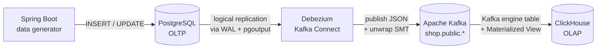

# OLTP → OLAP Sync Demo

Demo CDC pipeline: **PostgreSQL (OLTP) → Debezium → Kafka → ClickHouse (OLAP)**.

Spring Boot generator melempar transaksi e-commerce ke Postgres, Debezium menangkap perubahan via logical replication, lalu ClickHouse meng-consume topik Kafka pakai `Kafka` engine + materialized view.



## Prasyarat

- Podman 4+ (atau `podman-compose`) — semua command pakai `podman compose`
- Java 21 + Maven (untuk run generator)
- `curl`, `jq` (opsional, untuk register connector)
- `psql` client (opsional)

## Quick Start

```bash
# 1. Naikkan stack (Postgres, Kafka, Connect, ClickHouse)
make up

# 2. Tunggu sampai Connect siap (~30 detik), lalu register connector
make register

# 3. Cek status connector — pastikan state RUNNING
make status

# 4. Run generator (terminal baru)
make generator

# 5. Buka ClickHouse client (terminal baru) dan jalankan query analytics
make ch
```

Stop tanpa hapus data:

```bash
make down
```

Reset semua volume:

```bash
make clean
```

## Sample Analytics Query (ClickHouse)

ReplacingMergeTree tidak deduplikasi otomatis sampai background merge — gunakan modifier `FINAL` untuk view real-time, dan filter `is_deleted = 0`.

**Top 5 produk by revenue:**

```sql
SELECT
    p.name             AS product,
    p.category         AS category,
    sum(oi.quantity)   AS units_sold,
    sum(oi.quantity * oi.unit_price) AS revenue
FROM order_items AS oi FINAL
JOIN products    AS p  FINAL ON p.id = oi.product_id
WHERE oi.is_deleted = 0 AND p.is_deleted = 0
GROUP BY p.name, p.category
ORDER BY revenue DESC
LIMIT 5;
```

**Order count per status:**

```sql
SELECT status, count() AS jumlah
FROM orders FINAL
WHERE is_deleted = 0
GROUP BY status
ORDER BY jumlah DESC;
```

**Revenue per kota (join orders + customers + order_items):**

```sql
SELECT
    c.city                                 AS city,
    count(DISTINCT o.id)                   AS total_orders,
    sum(oi.quantity * oi.unit_price)       AS revenue
FROM order_items AS oi FINAL
JOIN orders     AS o  FINAL ON o.id = oi.order_id
JOIN customers  AS c  FINAL ON c.id = o.customer_id
WHERE o.is_deleted = 0 AND c.is_deleted = 0 AND oi.is_deleted = 0
GROUP BY c.city
ORDER BY revenue DESC
LIMIT 10;
```

**Order per menit (lihat real-time ingestion):**

```sql
SELECT
    toStartOfMinute(created_at) AS minute,
    count()                     AS orders,
    sum(total_amount)           AS revenue
FROM orders FINAL
WHERE is_deleted = 0
GROUP BY minute
ORDER BY minute DESC
LIMIT 20;
```

## Verifikasi Pipeline

**1. Cek topic Kafka terbentuk setelah register connector:**

```bash
make topics
# harus muncul: shop.public.customers, shop.public.products, shop.public.orders, shop.public.order_items
```

**2. Cek isi tabel Postgres:**

```bash
make psql
\dt
SELECT count(*) FROM orders;
```

**3. Cek data sampai di ClickHouse:**

```bash
make ch
SELECT count() FROM orders;
SELECT count() FROM order_items;
```

## Struktur File

```
.
├── podman-compose.yml          # Stack: postgres, kafka, connect, clickhouse
├── Makefile                    # Shortcut command
├── postgres/init.sql           # Schema + REPLICA IDENTITY FULL + publication
├── clickhouse/init.sql         # Kafka source tables + ReplacingMergeTree + MV
├── debezium/postgres-connector.json  # Source connector dengan unwrap SMT
└── data-generator/             # Spring Boot 3 + JPA + Datafaker
    ├── pom.xml
    └── src/main/...
```

## Catatan Teknis

- **REPLICA IDENTITY FULL** — supaya UPDATE/DELETE event di Debezium membawa `before` state lengkap (bukan cuma PK). Cost-nya WAL lebih besar; untuk production biasanya pakai `DEFAULT` + PK saja.
- **`unwrap` SMT** — membuat payload jadi flat (langsung field-field tabel) sehingga ClickHouse `JSONEachRow` gampang parse. Dengan `delete.handling.mode=rewrite` setiap pesan punya kolom `__deleted` ('true'/'false') alih-alih tombstone.
- **`time.precision.mode=connect`** — semua timestamp dikirim sebagai epoch millis (Int64), jadi ClickHouse pakai `fromUnixTimestamp64Milli` untuk konversi.
- **`decimal.handling.mode=double`** — DECIMAL Postgres dikirim sebagai JSON number; di-cast ke `Decimal64(2)` di MV. Untuk presisi penuh, ganti ke `string` dan parse manual.
- **ReplacingMergeTree(updated_at)** — versi terbaru per primary key menang. Background merge mendeduplikasi; query ad-hoc pakai `FINAL` atau `argMax(field, updated_at)`.
- **Kafka KRaft mode** — tanpa Zookeeper, image apache/kafka 3.8.0.

## Troubleshooting

- **Connector REGISTRATION failed: replication slot already exists** → `make clean` lalu `make up` ulang, atau drop slot manual: `SELECT pg_drop_replication_slot('debezium_shop');`
- **ClickHouse tidak menerima data** → cek connector status `make status`. Pastikan topik Kafka ada (`make topics`). Cek error: `podman logs olap-clickhouse | grep -i kafka`.
- **Generator gagal connect Postgres** → host port di-set ke `5433` (container internal tetap 5432) untuk menghindari bentrok dengan Postgres lokal.
