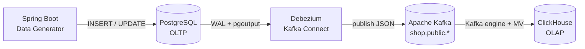
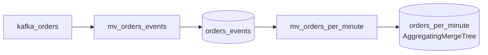

# OLTP → OLAP Real-Time Sync

### Membangun Pipeline Change Data Capture dengan PostgreSQL, Kafka & ClickHouse

Demo end-to-end: dari transaksi operasional ke analytics real-time tanpa batch ETL.

<!-- Speaker note: Slide pembuka. Sebut tujuan: menunjukkan cara data transaksi (OLTP) mengalir otomatis ke database analitik (OLAP) dalam hitungan detik. -->

---

## Masalah: Satu Database Tidak Cukup

Database transaksional dan analitik punya kebutuhan yang bertolak belakang.

| Aspek | OLTP (PostgreSQL) | OLAP (ClickHouse) |
|-------|-------------------|-------------------|
| Pola akses | Banyak write kecil | Scan agregasi besar |
| Operasi khas | `INSERT` / `UPDATE` 1 row | `SUM` / `GROUP BY` jutaan row |
| Storage | Row-oriented | Column-oriented |
| Tujuan | Jalankan bisnis | Pahami bisnis |

Menjalankan query analytics berat di OLTP → **ganggu transaksi production**.

---

## Solusi: Pisahkan, Lalu Sinkronkan

Biarkan setiap database melakukan yang terbaik — sambungkan dengan **Change Data Capture (CDC)**.

- **OLTP** tetap ringan, fokus melayani transaksi
- **OLAP** menerima salinan data, fokus untuk analytics
- **CDC** menjembatani: setiap perubahan di OLTP otomatis mengalir ke OLAP

> Bukan batch ETL tengah malam — perubahan terlihat di OLAP dalam **hitungan detik**.

---

## Apa Itu Change Data Capture?

CDC membaca **transaction log** database, bukan melakukan query polling.

- PostgreSQL menulis setiap perubahan ke **WAL** (Write-Ahead Log)
- CDC tool membaca WAL → mendapat stream `INSERT` / `UPDATE` / `DELETE`
- Tidak ada beban query tambahan ke tabel production
- Tidak ada kolom `updated_at` polling, tidak ada trigger

> Database sudah mencatat semua perubahan untuk durability — CDC tinggal "menguping".

---

## Arsitektur



5 komponen, semua berjalan dalam container Podman.

---

## Stack Teknologi

| Komponen | Teknologi | Peran |
|----------|-----------|-------|
| Data Generator | Spring Boot 3 + JPA | Simulasi transaksi e-commerce |
| OLTP | PostgreSQL 16 | Database transaksional |
| CDC Engine | Debezium 2.7 | Baca WAL, publish perubahan |
| Message Broker | Apache Kafka 3.8 (KRaft) | Buffer & distribusi event |
| OLAP | ClickHouse 24.8 | Database analitik columnar |

Domain demo: **e-commerce** — `customers`, `products`, `orders`, `order_items`.

---

## Data Flow — Langkah demi Langkah

1. **Generator** meng-`INSERT` order baru ke PostgreSQL
2. **PostgreSQL** mencatat perubahan ke WAL
3. **Debezium** membaca WAL via `pgoutput`, ubah jadi event JSON
4. **Kafka** menerima event di topik `shop.public.<table>`
5. **ClickHouse** consume topik via `Kafka` engine
6. **Materialized View** transform & tulis ke tabel analitik

Latensi total: **sub-detik** dari `INSERT` sampai bisa di-query di OLAP.

---

## Sisi PostgreSQL — Menyiapkan WAL

CDC butuh PostgreSQL dikonfigurasi untuk **logical replication**.

```sql
-- wal_level=logical (di-set saat start container)
ALTER TABLE orders REPLICA IDENTITY FULL;

CREATE PUBLICATION dbz_publication
  FOR TABLE customers, products, orders, order_items;
```

- `wal_level=logical` → WAL berisi cukup info untuk direkonstruksi
- `REPLICA IDENTITY FULL` → event `UPDATE`/`DELETE` membawa *before-state* lengkap
- `PUBLICATION` → daftar tabel yang di-CDC

---

## Sisi Debezium — Dari WAL ke JSON

Debezium mengubah perubahan WAL mentah menjadi event yang rapi.

```json
{
  "id": 42, "customer_id": 7, "status": "PAID",
  "total_amount": 825000.0, "__deleted": "false"
}
```

- **`unwrap` SMT** → flatten payload, langsung field tabel (mudah di-parse)
- **`__deleted` flag** → `DELETE` jadi event biasa, bukan tombstone
- 1 tabel = 1 topik Kafka → konsumen bisa berlangganan selektif

---

## Sisi ClickHouse — Ingestion Tanpa Kode

Sinkronisasi Kafka → ClickHouse **100% deklaratif SQL**. Tidak ada consumer app.

```sql
-- 1. Kafka engine table = consumer
CREATE TABLE kafka_orders (...) ENGINE = Kafka
  SETTINGS kafka_topic_list = 'shop.public.orders', ...;

-- 2. Materialized View = trigger transform
CREATE MATERIALIZED VIEW mv_orders TO orders AS
  SELECT id, status, toDecimal64(total_amount,2), ...
  FROM kafka_orders;

-- 3. ReplacingMergeTree = storage final
```

Consumer berjalan **di dalam ClickHouse** (native C++), bukan thread aplikasi.

---

## Menangani UPDATE & DELETE

OLAP umumnya append-only — bagaimana menangani perubahan row?

- **`ReplacingMergeTree(updated_at)`** → versi dengan `updated_at` terbaru menang
- **`is_deleted` flag** → `DELETE` jadi soft-delete, bukan hapus fisik
- Query pakai modifier **`FINAL`** untuk dedup saat baca

```sql
SELECT count() FROM orders FINAL WHERE is_deleted = 0;
```

> Setiap `UPDATE` di OLTP = row versi baru di OLAP. Merge di background mendedup.

---

## Fitur Unggulan #1 — Real-Time, Bukan Batch

Perubahan mengalir terus-menerus, bukan menunggu jadwal ETL.

- Order yang dibuat **detik ini** bisa di-query di ClickHouse **detik ini juga**
- Tidak ada window staleness berjam-jam seperti batch tradisional
- Kafka sebagai buffer → OLAP boleh down, event tidak hilang

Cocok untuk: **live dashboard, fraud detection, monitoring operasional**.

---

## Fitur Unggulan #2 — Zero Sync Code

Tidak ada satu baris pun kode aplikasi untuk memindahkan data Kafka → OLAP.

- Tidak ada Kafka consumer untuk ditulis & dipelihara
- Tidak ada retry logic, offset management, deserialization manual
- Semua cukup **DDL SQL**: `Kafka` engine + `Materialized View`

> Kurang kode = kurang bug = kurang maintenance.

---

## Fitur Unggulan #3 — Kekuatan Analitik Time-Series

ClickHouse punya fungsi analitik bawaan yang lambat/mustahil di OLTP.

```sql
-- Funnel konversi order dalam 1 query
SELECT level, count() FROM (
  SELECT id, windowFunnel(3600)(toDateTime(updated_at),
    status='PLACED', status='PAID',
    status='SHIPPED', status='DELIVERED') AS level
  FROM orders_events GROUP BY id
) GROUP BY level;
```

`windowFunnel`, `quantile`, window function, `WITH FILL` — semua native.

---

## Fitur Unggulan #4 — Pre-Aggregation Berlapis

Chain Materialized View untuk dashboard sub-milidetik.



- `orders_events` → simpan **semua versi** status (untuk funnel)
- `orders_per_minute` → agregat per menit dihitung **saat insert**
- Dashboard query baca hasil jadi, tidak scan ulang

---

## Fitur Unggulan #5 — Fan-Out Satu Sumber

Satu Kafka engine table bisa men-feed **banyak** target sekaligus.

- `mv_orders` → tabel `orders` (current state, ReplacingMergeTree)
- `mv_orders_events` → tabel `orders_events` (full history, MergeTree)

Dari satu stream Kafka yang sama:
- **Current state** untuk query "berapa order PAID sekarang?"
- **Event history** untuk query "berapa lama PLACED → DELIVERED?"

---

## Fitur Unggulan #6 — Live Dashboard

Generator menyertakan **Stream Inspector UI** di `http://localhost:8080`.

- Tab Customers / Products / Orders dengan pagination & sort
- Auto-refresh tiap 5 detik — lihat data streaming masuk
- Live count badge, status pill berwarna
- REST API: `GET /api/orders`, `/api/customers`, `/api/products`

Plus ClickHouse Web UI bawaan: `/play` (SQL editor) & `/dashboard` (monitoring).

---

## Yang Akan Didemokan Live

1. Buka **Stream Inspector** — order baru muncul tiap beberapa detik
2. `make status` — Debezium connector `RUNNING`
3. `make topics` — 4 topik Kafka terbentuk otomatis
4. **ClickHouse Play** — jalankan query analytics, angka terus naik
5. Funnel analysis — konversi `PLACED → PAID → SHIPPED → DELIVERED`
6. Bandingkan: data yang sama, dua database, dua tujuan berbeda

---

## Pelajaran dari Pembangunan

Beberapa keputusan teknis penting:

- **`time.precision.mode`** → timestamp ter-serialize sebagai string ISO, bukan epoch
- **Sintaks `FINAL`** → harus *setelah* alias: `FROM t AS x FINAL`
- **`windowFunnel`** → butuh `DateTime`, perlu cast dari `DateTime64`
- **Port bentrok** → Postgres host dipetakan ke `15432`, hindari konflik lokal
- **Kafka KRaft mode** → tanpa Zookeeper, setup lebih sederhana

---

## Alternatif Arsitektur

Pipeline ini bukan satu-satunya cara — pilih sesuai kebutuhan.

| Pendekatan | Kapan Dipakai |
|------------|---------------|
| Debezium + Kafka (demo ini) | Banyak konsumen, butuh buffer, production-grade |
| `MaterializedPostgreSQL` engine | 1 konsumen, ingin setup minimal |
| Batch ETL (Airflow, dbt) | Latensi jam-an OK, transformasi kompleks |

ClickHouse juga support stream dari **RabbitMQ, NATS, S3Queue**.

---

## Ringkasan

Demo ini menunjukkan pola CDC modern secara end-to-end:

- **Pisahkan** beban OLTP dan OLAP — masing-masing optimal
- **Sinkronkan** via CDC — real-time, log-based, non-intrusif
- **Deklaratif** — Kafka engine + Materialized View, tanpa kode sync
- **Powerful** — funnel, pre-aggregation, time-series analytics

> Dari transaksi ke insight, dalam hitungan detik.

---

## Terima Kasih

### Pertanyaan?

Repo: `github.com/ProgrammerZamanNow/oltp-olap-demo`

Coba sendiri: `make up` → `make register` → buka `localhost:8080`
